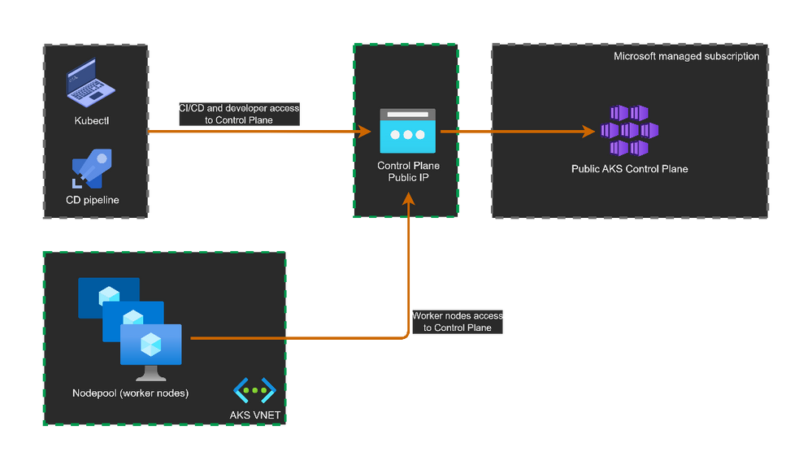
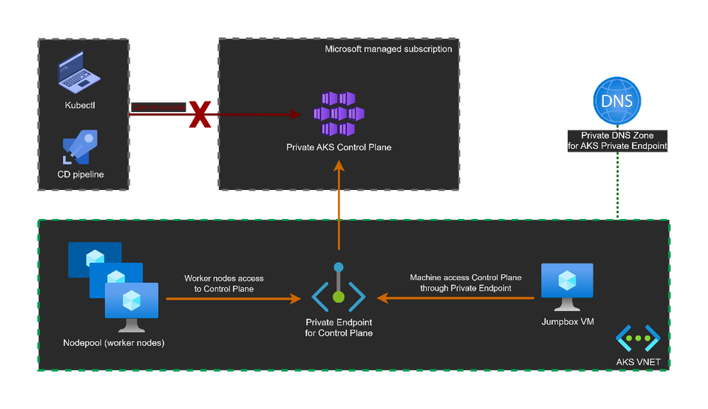

### Concept of Public & Private AKS Cluster

1. Public & Private AKS Cluster means the Control Plane accessibility. Exposing application is a different concept. 
2. Public AKS is exposed through a Public IP and hence if we connect the AKS cluster with kubeconfig, we can directly communicate to the Control Plane.

3. Private AKS is not exposed through a Public IP and hence if we connect the AKS cluster with kubeconfig, we cannot directly communicate to the Control Plane. As it will give error as "host not found".

   * However, we can connect to Private AKS Cluster by 2 means:
        1. By creating a VM within the same VNET where the Worker Nodes are created(i.e. MC_Infrastructure_ResourceGroup) OR create a VM and then create AKS Private Cluster in the VNET of the VM.
        > This will allow access to the application and also allow to run kubectl commands directly. Ideal for Azure DevOps Self Hosted VM.
        2. By creating a VNET for VM and enabling VNET Peering between VNET of VM Scale Set and VNET of the VM.
        > This will allow to ping the Worker nodes IP and even allow to access application running as NodePort (http://AnyWorkerNodeIP:NODEPORT) or as Internal Loadbalancer using its External IP(private IP) but to run kubectl commands using "az command invoke"
        ```bash
        az aks command invoke --resource-group RESOURCEGROUP --name AKSCLUSTERNAME --command "kubectl apply -f deployApp.yaml -n NAMESPACE" --file deployApp.yaml
        # Note: --file refers to the file locally available from where we are connecting, e.g. the VM in the same VNET of AKS.
        ```
#

### Concept of ClusterIP, NodePort & Internal LoadBalancer Services

1. ClusterIP is only used for internal communication and hence we cannot use the Cluster IP to access an application over a browser.
   > We can use Ingress concept though using routing to ClusterIP. ClusterIP Service is static IP and does not affect even if Pods selected by the Service are added, removed, or replaced, the ClusterIP remains the same. It provides a stable entry point for accessing the underlying Pods.
   ```yaml
    apiVersion: v1
    kind: Pod
    metadata:
    name: nginx
    labels:
        app.kubernetes.io/name: proxy
    spec:
    containers:
    - name: nginx
        image: nginx:stable
        ports:
        - containerPort: 80
            name: http-web-svc

    ---
    apiVersion: v1
    kind: Service
    metadata:
        name: nginx-service
    spec:
        selector:
            app.kubernetes.io/name: proxy
        ports:
        - name: name-of-service-port
            protocol: TCP
            port: 80
            targetPort: http-web-svc
   ```
2. NodePort exposes an application to a specific port (30000-32767) of the Worker Nodes. We can access the application on browser using http://PUBLICIPofAnyWorkerNode:NodePort, however, if the Node pools are not exposed using Public IP, we can access using a VM within the same VNET of AKS NodePools using http://PRIVATEIPofAnyWorkerNode:NodePort. The VM should have GUI to access the browser.
   ```yaml
    apiVersion: v1
    kind: Service
    metadata:
        name: my-service
    spec:
        type: NodePort
        selector:
            app.kubernetes.io/name: MyApp
        ports:
            # By default and for convenience, the `targetPort` is set to the same value as the `port` field.
            - port: 80
              targetPort: 80
              # Optional field
              # By default and for convenience, the Kubernetes control plane will allocate a port from a range (default: 30000-32767)
              nodePort: 30007
   ```
3. If we create a Service LoadBalancer, it will create a Public IP for external access but not when the AKS cluster is Private. However, if we want to keep my application Private and dont want to expose as NodePort, we can use Internal Loadbalancer(ILB) and for that we need to add anotation. So, when we create an Internal Load Balancer, we get an External IP which is basically a Private IP and we can access similar to NodePort.
> It is preferable to expose application using ILB rather than using NodePort. An ILB provides an additional layer of security by keeping our services entirely private. With NodePort, even though it might be restricted to internal access, it is technically exposed on specific ports on the worker nodes, making it less secure. In contrast, ILB enforces a strict level of isolation, reducing the attack surface.
```yaml
apiVersion: v1
kind: Service
metadata:
  name: my-service
  annotations:
    service.beta.kubernetes.io/azure-load-balancer-internal: "true"
spec:
  selector:
    app.kubernetes.io/name: MyApp
  ports:
    - protocol: TCP
      port: 80
      targetPort: 9376
  type: LoadBalancer
```


### Concept of Nginx Ingress Controller or ISTIO Ingress

1. If we use LoadBalancer for each application we will have multiple endpoints for accessing each services. Also Ingress gateway has a Single IP which can be either mapped to Backend of ALB or Firewall and we can route the Public IP of Firewall to the private IP of Ingress gateway(nginx/Istio)
2. To Install any Ingress, preferred way is to use HELM charts. Ensure the VM from where we are accessing the ControlPlane should have HELM installed. Ensure to pass the image to ACR for Private access.
3. Once, NGINX INGRESS CONTROLLER or ISTIO is completed, we can create application services as ClusterIP.
4. Now create Kuberenetes Object "Ingress" and under spec pass all the desired path or endpoints and map ts backend.service with the application specific ClusterIP service as a list.
   >We can create Ingress Controller IP as Private using annotations and map that to ALB or FIREWALL.